#spark高级练习一
###练习1：分析整数数据集
#####准备数据集代码：
```python
//初始化spark环境
SparkConf conf = new SparkConf().setMaster("local[1]").setAppName("basicPracticeOne");
JavaSparkContext jsc = new JavaSparkContext(conf);
//创建数据集
List<Integer> result = new ArrayList<Integer>();
for(int i = 100; i <= 1000; i++) result.add(i);
JavaRDD<Integer> input = jsc.parallelize(result, 7);
```
#####打印input中前5个数据
```python
System.out.println("前５个数: " + input.take(5));
```
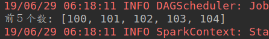
#####输出input中所有元素和
```python
Integer sum = input.reduce(new Function2<Integer, Integer, Integer>() {
            @Override
            public Integer call(Integer x, Integer y) throws Exception {
                return x + y;
            }
        });

        System.out.println("所有元素求和：" + sum);
```
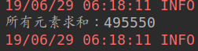
#####输出input中所有元素的平均值
```python
ong inputSize = input.count();

        System.out.println("平均值：" + sum*1.0 / inputSize);
```
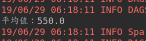
#####统计input中偶数的个数，并打印前5个
```python
//统计input中偶数的个数，并打印前5个
        JavaRDD<Integer> evenRdd = input.filter(new Function<Integer, Boolean>() {
            @Override
            public Boolean call(Integer integer) throws Exception {
                return integer % 2 == 0;
            }
        });
        System.out.println("偶数的个数：" + evenRdd.count());

        System.out.println("前５个偶数：" + evenRdd.take(5));
```
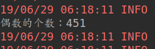
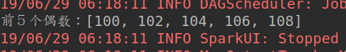
###练习2：高级RDD算子
#####准备数据集代码：
```python
//初始化JavaSparkContext
        SparkConf conf = new SparkConf().setMaster("local[1]").setAppName("BasicPracticeTwo");
        JavaSparkContext jsc = new JavaSparkContext(conf);

        //初始化数据
        List<Integer> data = Arrays.asList(1,2,3,4,5, 6);
        JavaRDD<Integer> rdd1 = jsc.parallelize(data, 3);
        List<Integer> data2 =Arrays.asList(7,8,9,10,11);
        JavaRDD<Integer> rdd2 = jsc.parallelize(data, 2);
        List<Integer> data3=Arrays.asList(12,13,14,15,16, 17, 18, 19, 20, 21);
        JavaRDD<Integer> rdd3 = jsc.parallelize(data3, 3);
```
#####使用union连接rdd1和rdd2，生成rdd4
```python
//union
        JavaRDD<Integer> rdd4 = rdd1.union(rdd2);
        System.out.println("rdd4   " + rdd4.collect());
```
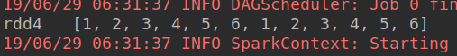
#####使用glom打印rdd4的各个partition
```python
//使用glom打印rdd4的各个partition
        System.out.println("rdd4 partition " + rdd4.glom().collect());
```
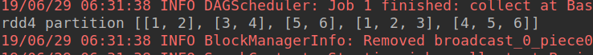
#####使用coalesce将rdd4的分区数改为3，并生成rdd5
```python
//使用coalesce将rdd4的分区数改为3，并生成rdd5
        JavaRDD<Integer> rdd5 = rdd4.coalesce(3);
        System.out.println("rdd5 partition" + rdd5.glom().collect());
```
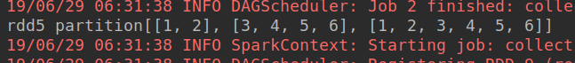
#####使用repartition将rdd4的分区数改为10，并生成rdd6
```python
//使用repartition将rdd4的分区数改为10，并生成rdd6
        JavaRDD<Integer> rdd6 = rdd4.repartition(10);
        System.out.println("rdd6 repartition" + rdd6.glom().collect());
```
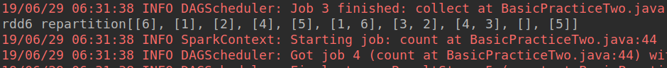
#####使用glom分别打印rdd5和rdd6中的partition元素均匀性
```python
JavaRDD<List<Integer>> rdd5_glom = rdd5.glom();
        JavaRDD<List<Integer>> rdd6_glom = rdd6.glom();
        long rdd5_glom_size = rdd5_glom.count();
        long rdd6_glom_size = rdd6_glom.count();
        System.out.println("rdd5 共有　" + rdd5_glom_size + "个partition");

        rdd5_glom.foreach(new VoidFunction<List<Integer>>() {
            @Override
            public void call(List<Integer> l) throws Exception {
                System.out.println("第个partition是　" + l);
            }
        });

        List<List<Integer>> partition_list_rdd5 = rdd5_glom.collect();
        for(int i = 0; i < rdd5_glom_size; i++){
            System.out.println("第"+(i + 1)+"个partition是"+ partition_list_rdd5.get(i).toString());
        }
```
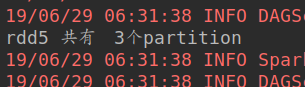
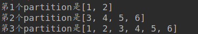
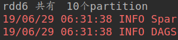
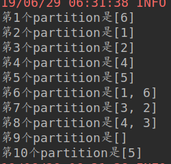
#####思考：如果要遍历某个RDD,直接使用RDD的foreach函数效率高还是先同collect函数将RDD转换为list然后再for循环遍历效率更高？我认为直接使用foreach函数效率更高，原因说不清楚。
###练习3：Key/Value RDD算子
#####计算相同Key对应的的所有value的平均值，并输出到目录/tmp/output下
```python
SparkConf conf = new SparkConf().setMaster("local[1]").setAppName("BasicPracticeThree");
        JavaSparkContext jsc = new JavaSparkContext(conf);
        jsc.setLogLevel("error");
        List<Tuple2<String, Integer>> data = Arrays.asList(
                new Tuple2("coffee", 1),
                new Tuple2("coffee", 3),
                new Tuple2("panda", 4),
                new Tuple2("coffee", 5),
                new Tuple2("street", 2),
                new Tuple2("panda", 5)
        );
        JavaPairRDD<String, Integer> input = jsc.parallelizePairs(data);

        //计算相同Key对应的的所有value的平均值，并输出到目录/tmp/output下
        JavaPairRDD<String, Iterable<Integer>> groupRdd = input.groupByKey();
        JavaPairRDD<String, Double> groupRdd_avg = groupRdd.mapValues(new Function<Iterable<Integer>, Double>() {
            @Override
            public Double call(Iterable<Integer> integers) throws Exception {
                Integer sum = 0;
                Integer count_numbers = 0;
                for (Integer itr:
                        integers) {
                    sum += itr;
                    ++count_numbers;
                }
                return sum*1.0 / count_numbers;
            }
        });
        groupRdd_avg.saveAsTextFile("data/ml-1m/groupRdd_avg.txt");


        jsc.stop();
```
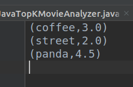
###练习4：沃尔玛交易流水分析
#####从/tmp/input.txt中读取数据到RDD中，用RDD的transformation函数实现下列功能SELECT id, SUM(x), MAX(y), MIN(z), AVERAGE(x) FROM T GROUP BY id
```python
SparkConf conf = new SparkConf()
                .setMaster("local[1]")
                .setAppName("basicPracticeFour");
        JavaSparkContext jsc = new JavaSparkContext(conf);
        //初始化Session
        SparkSession ss = SparkSession.builder().master("local").getOrCreate();
        //从data/ml-1m/input.txt中读取数据到RDD中
        JavaRDD<String> input = jsc.textFile("data/ml-1m/input.txt");
        /**
         * 用RDD的transformation函数实现下列功能SELECT id,
         * SUM(x), MAX(y), MIN(z), AVERAGE(x) FROM T GROUP BY id;
         */
        JavaRDD<Row> input_json = input.map(new Function<String, Row>() {
            @Override
            public Row call(String s) throws Exception {
                String[] distribute = s.split(",");
                return RowFactory.create(distribute);
            }
        });
        JavaPairRDD<String, List<String>> pairRDD_id = input_json.mapToPair(new PairFunction<Row, String, List<String>>() {
            @Override
            public Tuple2<String, List<String>> call(Row row) throws Exception {
                String[] rowStr = row.toString().split(",");
                String[] values = row.toString().substring(1, row.toString().length()-1).split(",");
                List list_value = Arrays.asList(values);
                String movie_id = rowStr[0].toString();
                return new Tuple2<>(movie_id, list_value);
            }
        });
        //按照id分组
        JavaPairRDD<String, Iterable<List<String>>> groupRdd = pairRDD_id.groupByKey();
        //进行计算
        JavaPairRDD<String, String> result =  groupRdd.mapValues(new Function<Iterable<List<String>>, String>() {
            @Override
            public String call(Iterable<List<String>> lists) throws Exception {
                String id = "";
                int x = 0, y = 0, z = 0;
                int itr = 0;
                for (List<String> list:
                        lists) {
                    ++itr;
                    int tmp_x = 0, tmp_y = 0, tmp_z = 0;
                    id = list.get(0);
                    tmp_x = Integer.parseInt(list.get(1).toString());
                    tmp_y = Integer.parseInt(list.get(2).toString());
                    tmp_z = Integer.parseInt(list.get(3).toString());
                    //分别计算ｘ,y,z的值
                    if(itr < 2){//先保存第一个ｚ值
                        z = tmp_z;
                    }
                    z = tmp_z > z ? z : tmp_z;
                    y = tmp_y > y ? tmp_y : y;
                    x += tmp_x;

                }
                String resutl = "ID " + id + ", max(y)=" + y + ",min(z)=" + z + ",avg(x)=" + x * 1.0 / itr;
                return resutl;
            }
        });
        List<List<Tuple2<String, String>>> result_list = result.glom().collect();
        for (List<Tuple2<String, String>> list:
                result_list) {
            for (Tuple2<String, String> t:
                    list) {
                System.out.println(t._2);
            }
        }
        /**
         * 将RDD转换为DataFrame,实现SELECT id,
         * SUM(x), MAX(y), MIN(z), AVERAGE(x) FROM T GROUP BY id
         */
        //创建schema
        String schemaString = "id x y z";
        List<StructField> fields = new ArrayList<StructField>();
        for (String fieldName : schemaString.split(" ")) {
            StructField field = DataTypes.createStructField(fieldName, DataTypes.StringType, true);
            fields.add(field);
        }
        StructType schema = DataTypes.createStructType(fields);

        Dataset<Row> moviesDataFrame = ss.createDataFrame(input_json, schema);
        moviesDataFrame.show();
        //使用max和min的时候必须将数值类型转换为int或long
        moviesDataFrame.select(moviesDataFrame.col("id").cast("int"),
                moviesDataFrame.col("x").cast("int"),
                moviesDataFrame.col("y").cast("int"),
                moviesDataFrame.col("z").cast("int")).groupBy("id")
                .agg(max("y"), min("z"),avg("x")).
                orderBy("id").show();
```
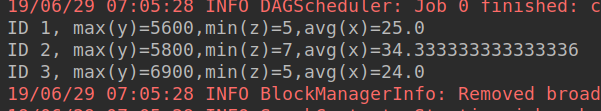
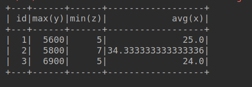
#####总结：我用两种方式实现以上功能，
#####第一种：用RDD实现首先将原始RDD转换为以ID为key以其余列为value的<String, List>的PairRDD,然后根据ID将生成的PairRdd进行聚合，最后通过mapValues函数获取到每个ID对应的值并进行计算；
#####第二种：用DataSet方式实现，首先将原始RDD转换为DataSet,然后通过select函数实现功能；
#####通过代码发现初始化DataSet的时候需要SparkSession,初始化RDD的时候需要JavaSparkContext;所以我总结在使用Spark sql的时候要用SparkSession，在java环境使用RDD的时候需要用JavaSparkContext
#spark高级练习二
###练习1：统计HTTP日志返回代码
#####使用累加器计数,打印出总数，400的个数，200的个数
```python
SparkConf conf = new SparkConf()
                .setMaster("local[1]")
                .setAppName("LogStatistics");
        JavaSparkContext jsc = new JavaSparkContext(conf);

        final Accumulator<Integer> total = jsc.accumulator(0);
        final Accumulator<Integer> count400 = jsc.accumulator(0);
        final Accumulator<Integer> count200 = jsc.accumulator(0);

        JavaRDD<String> input = jsc.textFile("data/access.log");
        input.foreach(s -> {
            String[] row = s.split(",");
            // TODO add your code here
            String logStr = row[0];
            if (logStr.contains("400")){
                count400.add(1);
            }else if(logStr.contains("200")){
                count200.add(1);
            }else{
                total.add(1);
            }
        });
        System.out.println("总数: "+total);
        System.out.println("400的个数: "+count400);
        System.out.println("200的个数"+count200);

        jsc.stop();
```
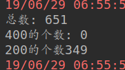
###练习2：哈姆雷特词频分析
#####将读取的停止词广播到各个executor
```python
Broadcast<Long> count_stopwords = jsc.broadcast(stopwords_count);
```
#####使用累加器同时统计总单词数和总停止词数
```python
JavaRDD<String> filteredWords = words.filter(new Function<String, Boolean>() {
            @Override
            public Boolean call(String v1) throws Exception {
                // TODO filter stop words, increase countTotal or stopTotal
                boolean is_not_stopword = true;
                //判断当前的单词是否是停止词
                if("a".equals(v1) || "the".equals(v1) || "by".equals(v1)
                || "I".equals(v1)){
                    is_not_stopword = false;
                    stopTotal.add(1);
                }
                countTotal.add(1);
                return is_not_stopword;
            }
        });
```

#####输出出现次数最高的前10个单词
```python
JavaPairRDD<String, Integer> counts = filteredWords.mapToPair(new PairFunction<String, String, Integer>() {
            @Override
            public Tuple2<String, Integer> call(String s) throws Exception {
                // TODO add your code here

                return new Tuple2<>(s, 1);
            }
        }).reduceByKey(new Function2<Integer, Integer, Integer>() {
            @Override
            public Integer call(Integer v1, Integer v2) throws Exception {
                // TODO add your code here
                return v1+v2;
            }
        });

        // TODO sort result
        JavaPairRDD<Integer, String> sort_count =
                counts.mapToPair(new PairFunction<Tuple2<String, Integer>, Integer, String>() {
                    @Override
                    public Tuple2<Integer, String> call(Tuple2<String, Integer> stringIntegerTuple2) throws Exception {
                        return new Tuple2<>(stringIntegerTuple2._2, stringIntegerTuple2._1);
                    }
                }).sortByKey(false);

        // TODO output result
        List list = sort_count.take(10);
        System.out.println("出现次数最高的前10个单词 "+list);
```
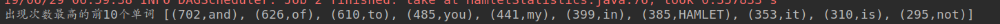
#简易电影受众系统课后作业
###女性看的最多的10部电影；男性看过最多的10部电影
```python
String dataPath = "data/ml-1m";
        SparkConf conf = new SparkConf().setAppName("TopKMovieAnalyzer");
        if (args.length > 0) {
            dataPath = args[0];
        } else {
            conf.setMaster("local[1]");
        }

        JavaSparkContext sc = new JavaSparkContext(conf);

        String ratint_path = dataPath + "/ratings.dat";
        String user_path = dataPath + "/users.dat";
        String movie_path = dataPath + "/movies.dat";

        JavaRDD<String> ratingsRdd = sc.textFile(ratint_path);
        JavaRDD<String> movieRdd = sc.textFile(movie_path);
        JavaRDD<String> userRdd = sc.textFile(user_path);


        //获取用户的用户ID和性别组成用户RDD
        JavaRDD<Tuple2<String, String>> userTupleRDD = userRdd
                .map(x -> x.split("::"))
                .map(x -> new Tuple2<>(x[0], x[1]));
        //获取movieid和title组成电影RDD
        JavaRDD<Tuple2<String, String>> movieTupleRDD = movieRdd
                .map(x -> x.split("::"))
                .map(x -> new Tuple2<>(x[0],x[1]));
        //获取UserID和movieid组成ratingsTupleRDD
        JavaRDD<Tuple2<String, String>> ratingsTupleRDD = ratingsRdd
                .map(x -> x.split("::"))
                .map(x -> new Tuple2<>(x[0],x[1]));

        /**
         * 首先将电影观看次数降序排序
         */
        JavaPairRDD<String, Integer> ratingsPairRdd = ratingsTupleRDD
                .mapToPair(x -> new Tuple2<>(x._1, 1))//将ratingsTupleRDD转换为<userid,1>的pair
                .reduceByKey((x, y) -> (x + y))//统计每个userID观看电影的次数
                .mapToPair(x -> new Tuple2<>(x._2, x._1))//将<userid,number>转换为<number, userid>方便排序
                .sortByKey(false)//降序排列
                .mapToPair(x -> new Tuple2<>(x._2, x._1));//将ＲＤＤ转换回<userid,number>
        /**
         * 然后将userTupleRDD转换为pair,并和ratingsPairRdd　join
         */
        JavaPairRDD<String, String> userPairRDD = userTupleRDD
                .mapToPair(x -> new Tuple2<>(x._1, x._2));

        JavaPairRDD<String, Tuple2<String, Integer>> userAndMovie = userPairRDD.join(ratingsPairRdd);
        //userAndMovie.foreach(x -> System.out.println(x));
        /**
         * 从中分别筛选出男生和女生看的最多的10部电影
         */
        JavaPairRDD<String, String> maleRatings = userAndMovie
                .mapToPair(x -> new Tuple2<>(x._2._1, x._2._2))
                .filter(x -> x._1.indexOf("M") > -1)
                .mapToPair(x -> new Tuple2<>(x._2.toString(), x._1));
        JavaPairRDD<String, String> femaleRatings = userAndMovie
                .mapToPair(x -> new Tuple2<>(x._2._1, x._2._2))
                .filter(x -> x._1.indexOf("F") > -1)
                .mapToPair(x -> new Tuple2<>(x._2.toString(), x._1));
        //moviePair
        JavaPairRDD<String, String> moviePair = movieTupleRDD
                .mapToPair(x -> new Tuple2<>(x._1, x._2));
        JavaPairRDD<String, Tuple2<String, String>> maleMovies = moviePair.join(maleRatings).distinct();
        System.out.println(":　");
        maleMovies
                .map(x -> x._2._1)
                .take(10)
                .forEach(x-> System.out.println("男生看的最多的10部电影之一: " + x));
        JavaPairRDD<String, Tuple2<String, String>> femaleMovies = moviePair.join(femaleRatings).distinct();
        femaleMovies
                .map(x -> x._2._1)
                .take(10)
                .forEach(x-> System.out.println("女生看的最多的10部电影之一: " + x));
```
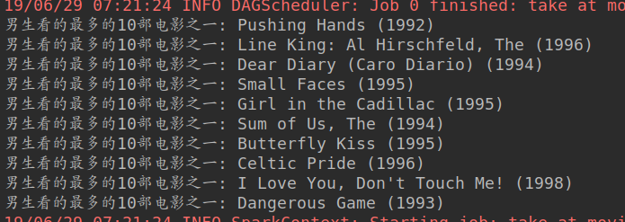
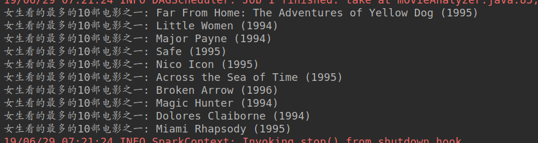
#####实现思路：首先将Rating数据根据观看的userid次数降序排列，然后和user数据集join得到男生和女生观看电影次数降序排列的数据，接着分别获取男生看的电影和女生看的电影，最后用得到的两个数据集分别和movie数据join获取到电影的title
